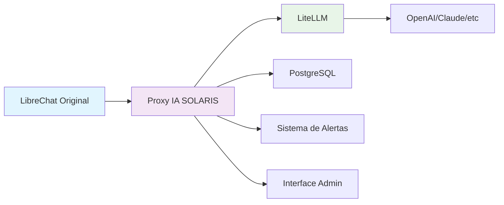

# 🎯 Visão do Negócio
## MVP Híbrido - Controle de Tokens IA SOLARIS

### 📋 **Índice desta Seção**

1. [Problema que Resolvemos](problema-solucao.md)
2. [Esclarecimento da Abordagem Técnica](esclarecimento-tecnico.md)
3. [Por que NÃO Modificamos o LibreChat](por-que-nao-modificar.md)

---

### 🎯 **Objetivo desta Seção**

Antes de mergulhar na implementação técnica, é fundamental entender:

- **Qual problema** estamos resolvendo
- **Por que escolhemos** a arquitetura híbrida
- **Quais são os benefícios** desta abordagem
- **Por que NÃO modificamos** o LibreChat

### 📊 **Resumo Executivo**

A IA SOLARIS precisa de **controle preciso de tokens por usuário** para:

1. **Monetização justa** - Cada usuário paga pelo que consome
2. **Controle de custos** - Evitar gastos excessivos com APIs
3. **Experiência do usuário** - Alertas e bloqueios inteligentes
4. **Escalabilidade** - Suportar crescimento sem modificar LibreChat

### 🏆 **Nossa Solução: MVP Híbrida**

### ✅ **Vantagens da Abordagem Híbrida**

| Benefício | Descrição |
|-----------|-----------|
| **🔒 Zero Modificações** | LibreChat permanece inalterado |
| **📊 Precisão 99%** | Controle exato via LiteLLM |
| **🚀 Implementação Rápida** | Componentes independentes |
| **🔧 Manutenção Fácil** | Updates sem afetar LibreChat |
| **📈 Escalável** | Cresce conforme necessidade |

### 📚 **Documentos de Referência**

- 📄 [PDF: Esclarecimento da Abordagem Técnica](../assets/pdfs/1-Esclarecimento_Abordagem_Técnica_da_MVP-v1.00.pdf)
- 📄 [PDF: Abordagem Híbrida Detalhada](../assets/pdfs/2-AbordagemhíbridaparaControledeTokensporUsuário-v1.00.pdf)
- 📄 [PDF: Controle Individual Garantido](../assets/pdfs/3-Controle_Individual_por_Usuário_na_MVP_Confiabilidade_Garantida-v1.00.pdf)

---

### 🚀 **Próximo Passo**

Agora que você entende o **contexto de negócio**, vamos mergulhar na **arquitetura técnica**:

**➡️ [Arquitetura e Conceitos](../02-arquitetura/)**

---

### 📖 **Navegação**

- ⬅️ [Início](../../README.md)
- ➡️ [Arquitetura](../02-arquitetura/)
- 📋 [Implementação](../03-implementacao/)
- 🎨 [Interfaces](../04-interfaces/)
- 🔧 [Referência](../05-referencia/)

