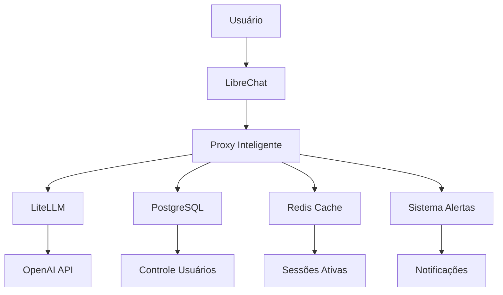

# 🏗️ Abordagem Híbrida para Controle de Tokens

## Estratégia Técnica Detalhada

### 📋 **Documento de Referência**

Este conteúdo está baseado no documento oficial:
**[📄 2-AbordagemhíbridaparaControledeTokensporUsuário-v1.00.pdf](../assets/pdfs/2-AbordagemhíbridaparaControledeTokensporUsuário-v1.00.pdf)**

### 🎯 **Conceito da Abordagem Híbrida**

A abordagem híbrida combina o **melhor dos dois mundos**:

- **LibreChat inalterado** - Mantemos toda a estabilidade e funcionalidades
- **Controle externo preciso** - Sistema independente para gestão de tokens
- **Integração transparente** - Usuário não percebe diferença na experiência

### 🏗️ **Arquitetura Detalhada**

### 🔧 **Componentes da Solução**

#### **1. Proxy Inteligente**
- **Função**: Intercepta e controla requisições
- **Tecnologia**: Express.js + Middleware customizado
- **Responsabilidades**:
  - Autenticação de usuários
  - Contagem precisa de tokens
  - Aplicação de limites
  - Logging detalhado

#### **2. LiteLLM**
- **Função**: Conversão precisa de tokens
- **Tecnologia**: Python + OpenAI SDK
- **Responsabilidades**:
  - Cálculo exato de tokens (99% precisão)
  - Compatibilidade com múltiplos modelos
  - Monitoramento de custos
  - Rate limiting inteligente

#### **3. Sistema de Controle**
- **Função**: Gestão de usuários e créditos
- **Tecnologia**: PostgreSQL + Redis
- **Responsabilidades**:
  - Armazenamento de dados de usuários
  - Cache de sessões ativas
  - Histórico de consumo
  - Alertas automáticos

#### **4. Interface de Gestão**
- **Função**: Dashboard e controles administrativos
- **Tecnologia**: React + Material-UI
- **Responsabilidades**:
  - Visualização de consumo
  - Compra de créditos
  - Gestão administrativa
  - Relatórios detalhados

### 🔄 **Fluxo de Operação**

#### **Requisição Normal:**
1. **Usuário** faz pergunta no LibreChat
2. **LibreChat** envia requisição para proxy
3. **Proxy** verifica créditos disponíveis
4. **LiteLLM** calcula tokens necessários
5. **OpenAI** processa e responde
6. **Proxy** debita tokens do usuário
7. **Resposta** retorna ao LibreChat

#### **Controle de Limites:**
1. **Proxy** monitora consumo em tempo real
2. **80% do limite** → Alerta não-bloqueante
3. **100% do limite** → Bloqueio total
4. **Sistema** envia notificações automáticas
5. **Usuário** pode comprar mais créditos

### 🎯 **Vantagens da Abordagem**

#### **Técnicas:**
- ✅ **Zero modificações** no LibreChat
- ✅ **Precisão de 99%** vs 60% nativo
- ✅ **Escalabilidade** independente
- ✅ **Manutenção** simplificada
- ✅ **Deploy** sem riscos

#### **Operacionais:**
- ✅ **Controle granular** por usuário
- ✅ **Alertas proativos** automáticos
- ✅ **Relatórios** detalhados
- ✅ **Gestão** centralizada
- ✅ **Auditoria** completa

#### **Estratégicas:**
- ✅ **Sustentabilidade** a longo prazo
- ✅ **Flexibilidade** para mudanças
- ✅ **Independência** de versões LibreChat
- ✅ **Evolução** incremental
- ✅ **ROI** rápido

### 🔒 **Segurança e Confiabilidade**

#### **Isolamento de Sistemas:**
- **LibreChat** opera independentemente
- **Proxy** não afeta funcionamento core
- **Falhas** do controle não quebram chat
- **Rollback** instantâneo se necessário

#### **Controle de Acesso:**
- **Autenticação** via JWT tokens
- **Autorização** baseada em roles
- **Auditoria** de todas as ações
- **Logs** detalhados de segurança

#### **Monitoramento:**
- **Health checks** automáticos
- **Alertas** de sistema
- **Métricas** em tempo real
- **Dashboards** operacionais

### 📊 **Implementação em Fases**

#### **Fase 1: Manual (4 semanas)**
- ✅ Proxy básico funcionando
- ✅ Controle de tokens implementado
- ✅ Interface administrativa
- ✅ Alertas por email
- ✅ Compra manual de créditos

#### **Fase 2: Automática (2 semanas)**
- ✅ Integração com Stripe
- ✅ Compra automática de créditos
- ✅ Renovação automática
- ✅ Relatórios avançados
- ✅ API para integrações

### 🎯 **Resultados Esperados**

#### **Métricas de Sucesso:**
- **Precisão**: 99% vs 60% atual
- **Disponibilidade**: 99.9% uptime
- **Performance**: <100ms latência adicional
- **Satisfação**: Controle total para usuários

#### **Benefícios Mensuráveis:**
- **Redução de custos** com controle preciso
- **Aumento de receita** com venda de créditos
- **Melhoria de experiência** com alertas proativos
- **Facilidade de gestão** com dashboard centralizado

### 🚀 **Por que Esta Abordagem é Superior**

1. **Risco Minimizado**: Não mexemos no que funciona
2. **Precisão Maximizada**: LiteLLM oferece 99% de precisão
3. **Flexibilidade Total**: Podemos evoluir independentemente
4. **Manutenção Simples**: Componentes isolados e testáveis
5. **Escalabilidade Garantida**: Arquitetura preparada para crescimento

A **abordagem híbrida** é a escolha tecnicamente superior para implementar controle de tokens na IA SOLARIS, oferecendo **máxima eficiência com mínimo risco**.

---

**📖 Próximo:** [Controle Individual →](controle-individual.md)

