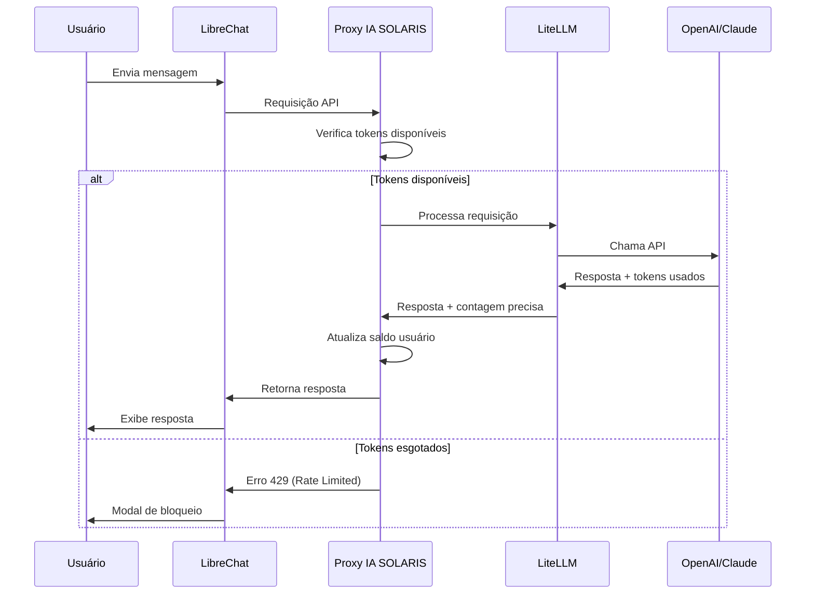

# 🎯 Problema que Resolvemos
## Controle de Tokens por Usuário na IA SOLARIS

### 🚨 **O Problema**

A IA SOLARIS enfrenta um desafio crítico de **controle de consumo**:

#### **Situação Atual**
- **LibreChat padrão** não controla tokens por usuário
- **Impossível monetizar** de forma justa
- **Risco de custos** descontrolados com APIs
- **Experiência ruim** para usuários (sem limites claros)

#### **Impacto no Negócio**
```
❌ Usuário A consome 10M tokens → Paga R$ 50
❌ Usuário B consome 100K tokens → Paga R$ 50
❌ Resultado: Prejuízo e insustentabilidade
```

### 💡 **Nossa Solução: MVP Híbrida**

#### **Abordagem Inteligente**
Em vez de modificar o LibreChat (complexo e arriscado), criamos um **proxy inteligente** que:

1. **Intercepta requisições** do LibreChat
2. **Controla tokens** via LiteLLM (precisão 99%)
3. **Aplica regras de negócio** (alertas, bloqueios)
4. **Mantém LibreChat** completamente inalterado

#### **Fluxo da Solução**


### 🎯 **Benefícios da Solução**

#### **Para o Negócio**
- ✅ **Monetização justa** - cada usuário paga pelo que usa
- ✅ **Controle de custos** - limites por usuário/plano
- ✅ **Escalabilidade** - cresce sem modificar LibreChat
- ✅ **Flexibilidade** - regras de negócio independentes

#### **Para os Usuários**
- ✅ **Transparência** - sabe exatamente quanto consumiu
- ✅ **Alertas inteligentes** - aviso aos 80% do limite
- ✅ **Experiência fluida** - LibreChat funciona normalmente
- ✅ **Compra de créditos** - processo simples e rápido

#### **Para Desenvolvedores**
- ✅ **Implementação simples** - componentes independentes
- ✅ **Manutenção fácil** - updates sem afetar LibreChat
- ✅ **Testabilidade** - cada componente isolado
- ✅ **Documentação completa** - guias passo a passo

### 📊 **Comparação de Abordagens**

| Aspecto | **MVP Híbrida** | Customização LibreChat |
|---------|-----------------|-------------------------|
| **Complexidade** | 🟢 Baixa | 🔴 Alta |
| **Risco** | 🟢 Baixo | 🔴 Alto |
| **Tempo Implementação** | 🟢 Rápido | 🔴 Lento |
| **Manutenibilidade** | 🟢 Fácil | 🔴 Difícil |
| **Precisão Tokens** | 🟢 99% | 🟡 60% |
| **Updates LibreChat** | 🟢 Automáticos | 🔴 Manuais |

### 🎯 **Casos de Uso Reais**

#### **Cenário 1: Usuário Plano Básico**
```
👤 João - Plano Mensal (1M tokens)
📊 Consumo atual: 750K tokens (75%)
🟡 Sistema: Continua normal
📱 Interface: Mostra "250K tokens restantes"
```

#### **Cenário 2: Usuário Próximo do Limite**
```
👤 Maria - Plano Mensal (1M tokens)
📊 Consumo atual: 850K tokens (85%)
🟠 Sistema: Envia alerta aos 80%
📱 Interface: Modal "Atenção: tokens quase esgotados"
💳 Ação: Oferece compra de créditos adicionais
```

#### **Cenário 3: Usuário Esgotou Tokens**
```
👤 Carlos - Plano Mensal (1M tokens)
📊 Consumo atual: 1M tokens (100%)
🔴 Sistema: Bloqueia novas requisições
📱 Interface: Modal "Tokens esgotados"
📧 Ação: Instrui envio de email para compra
```

### 🚀 **Próximos Passos**

Agora que você entende o problema e nossa solução, vamos detalhar:

1. **[Esclarecimento Técnico](esclarecimento-tecnico.md)** - Por que esta abordagem é superior


---

### 📖 **Navegação**

- ⬅️ [Visão do Negócio](README.md)
- ➡️ [Esclarecimento Técnico](esclarecimento-tecnico.md)
- 🏗️ [Arquitetura](../02-arquitetura/)
- 📋 [Implementação](../03-implementacao/)

