# 🏗️ Arquitetura e Conceitos
## MVP Híbrido - Controle de Tokens IA SOLARIS

### 📋 **Índice desta Seção**

1. [Diagrama Geral da Arquitetura](diagrama-geral.md)
2. [Componentes Principais](componentes.md)
3. [Fluxo de Dados e Sequências](fluxo-dados.md)
4. [Estados do Sistema](estados-sistema.md)

---

### 🎯 **Objetivo desta Seção**

Agora que você entende o **contexto de negócio**, vamos mergulhar na **arquitetura técnica**:

- **Como os componentes** se conectam
- **Qual o fluxo** de dados e requisições
- **Quais são os estados** do sistema
- **Como implementar** cada parte

### 🏗️ **Visão Geral da Arquitetura**

### 🎯 **Princípios Fundamentais**

#### **1. Separação de Responsabilidades**
- **LibreChat** → Interface e experiência do usuário
- **Proxy IA SOLARIS** → Controle de tokens e regras de negócio
- **LiteLLM** → Contabilização precisa e roteamento
- **PostgreSQL** → Persistência de dados

#### **2. Baixo Acoplamento**
- Cada componente pode ser **desenvolvido independentemente**
- **Falhas isoladas** não afetam todo o sistema
- **Updates** podem ser feitos sem parar outros serviços

#### **3. Alta Observabilidade**
- **Logs detalhados** em cada componente
- **Métricas** de consumo em tempo real
- **Alertas** automáticos para problemas

### 📊 **Componentes Principais**

| Componente | Responsabilidade | Tecnologia |
|------------|------------------|------------|
| **LibreChat** | Interface do usuário | React/Node.js |
| **Proxy IA SOLARIS** | Controle de tokens | Express.js |
| **LiteLLM** | Roteamento e contabilização | Python |
| **PostgreSQL** | Banco de dados | SQL |
| **Redis** | Cache e sessões | NoSQL |

### 🔄 **Fluxos Principais**

#### **Fluxo Normal (Tokens Disponíveis)**

```mermaid
graph TD
    A[Usuário envia mensagem] --> B[LibreChat recebe]
    B --> C[Proxy verifica tokens]
    C --> D{Tokens disponíveis?}
    D -->|Sim| E[LiteLLM processa]
    E --> F[API externa]
    F --> G[Resposta + contagem]
    G --> H[Atualiza saldo]
    H --> I[Retorna para usuário]
```

#### **Fluxo de Alerta (80% consumido)**

```mermaid
graph TD
    A[Verificação de saldo] --> B{Saldo < 20%?}
    B -->|Sim| C[Gera alerta]
    C --> D[Envia para interface]
    D --> E[Modal de aviso]
    E --> F[Usuário continua]
```

#### **Fluxo de Bloqueio (100% consumido)**

```mermaid
graph TD
    A[Requisição recebida] --> B[Verifica saldo]
    B --> C{Saldo = 0?}
    C -->|Sim| D[Bloqueia requisição]
    D --> E[Retorna erro 429]
    E --> F[Modal de bloqueio]
    F --> G[Instrução para compra]
```

### 🎨 **Diagramas Técnicos Disponíveis**

Esta seção inclui **10+ diagramas técnicos** organizados por complexidade:

#### **📊 Conceituais (Fácil)**
- [Arquitetura Geral](../assets/diagramas/DiagramadeArquiteturaMVPHíbrido.png)
- [Jornada do Usuário](../assets/diagramas/JornadaCompletadoUsuário-Fase1----Manual---+Fase2---Automática.png)
- [Processo de Negócio](../assets/diagramas/ProcessodeNegócioGestãoCompletadeTokens.png)

#### **🔧 Técnicos (Médio)**
- [Componentes Técnicos](../assets/diagramas/DiagramadeComponentesTécnicos.png)
- [Fluxo de Dados](../assets/diagramas/DiagramadeFluxodeDados.png)
- [Sequências de Operação](../assets/diagramas/1.SequênciaRequisiçãoNormalcomTokensDisponíveis.png)

#### **⚙️ Implementação (Avançado)**
- [Deployment](../assets/diagramas/DiagramadeDeployment(ArquiteturadeProdução).png)
- [Segurança](../assets/diagramas/DiagramadeSegurançaeAutenticação.png)
- [Monitoramento](../assets/diagramas/DiagramadeMonitoramentoeObservabilidade.png)

### 🎯 **Estados do Sistema**

O sistema opera em diferentes estados baseados no consumo:

#### **🟢 Estado Normal (0-79% consumido)**
- Requisições processadas normalmente
- Interface mostra saldo disponível
- Sem alertas ou bloqueios

#### **🟡 Estado de Alerta (80-99% consumido)**
- Requisições ainda processadas
- Modal de alerta exibido
- Opção de compra de créditos

#### **🔴 Estado de Bloqueio (100% consumido)**
- Requisições bloqueadas
- Modal de bloqueio exibido
- Instrução para compra via email

### 📚 **Documentos de Referência**

- 📄 [PDF: MVP Controle de Tokens](../assets/pdfs/4-MVPControledeTokensIASOLARIS.v1.00.pdf)
- 📄 [PDF: Diagramas Mermaid Completos](../assets/pdfs/6-DiagramasMermaid-MVPHíbridoControledeTokensIASOLARIS-v1.00.pdf)

---

### 🚀 **Próximo Passo**

Agora que você entende a **arquitetura geral**, vamos para a **implementação prática**:

**➡️ [Guia de Implementação](../03-implementacao/)**

---

### 📖 **Navegação**

- ⬅️ [Visão do Negócio](../01-negocio/)
- ➡️ [Implementação](../03-implementacao/)
- 🎨 [Interfaces](../04-interfaces/)
- 🔧 [Referência](../05-referencia/)
- 🏠 [Início](../../README.md)

