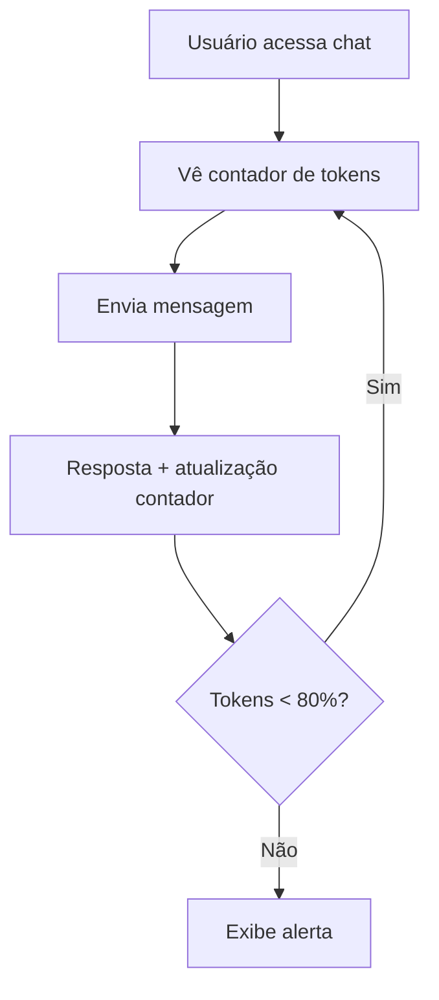
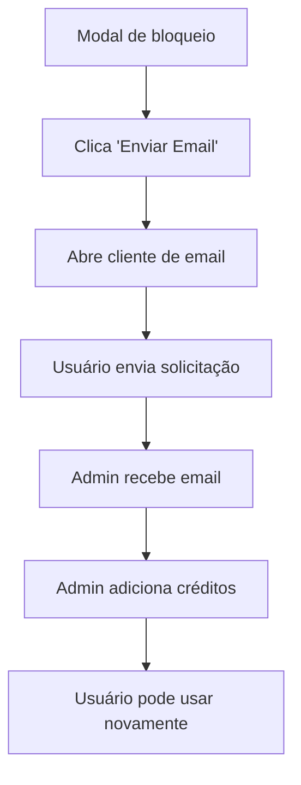
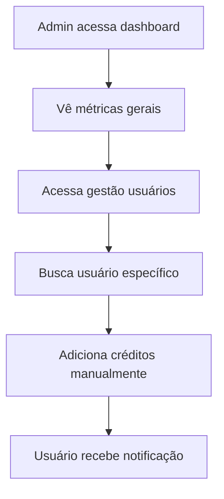

# 📱 Interfaces e UX
## MVP Híbrido - Controle de Tokens IA SOLARIS

### 📋 **Índice desta Seção**

1. [Mockups de Interface de Usuário](mockups-usuario.md)
2. [Mockups de Modais e Alertas](mockups-modais.md)
3. [Mockups de Interface Administrativa](mockups-admin.md)
4. [Especificações Técnicas](especificacoes-tecnicas.md)
5. [Fluxos de Usuário](fluxos-usuario.md)

---

### 🎯 **Objetivo desta Seção**

Esta seção apresenta **todas as interfaces** necessárias para implementação:

- **8 mockups completos** organizados por categoria
- **Especificações técnicas** detalhadas
- **Fluxos de usuário** completos
- **Componentes reutilizáveis** definidos
- **Guia de implementação** para cada tela

### 🎨 **Visão Geral das Interfaces**

### 📊 **Organização por Categoria**

#### **👤 Interface de Usuário (3 telas)**
| Tela | Dificuldade | Prioridade | Mockup |
|------|-------------|------------|---------|
| **Chat Principal** | 🟢 Fácil | 🔴 Alta | [Ver mockup](../assets/mockups/mockup_chat_principal.png) |
| **Extrato de Consumo** | 🟡 Médio | 🟡 Média | [Ver mockup](../assets/mockups/mockup_extrato_consumo.png) |
| **Compra de Créditos** | 🟡 Médio | 🟡 Média | [Ver mockup](../assets/mockups/mockup_compra_creditos.png) |

#### **🚨 Modais e Alertas (2 tipos)**
| Modal | Trigger | Prioridade | Mockup |
|-------|---------|------------|---------|
| **Alerta 80%** | Consumo ≥ 80% | 🔴 Alta | [Ver mockup](../assets/mockups/mockup_modal_alerta_80.png) |
| **Bloqueio 100%** | Consumo = 100% | 🔴 Alta | [Ver mockup](../assets/mockups/mockup_modal_bloqueio.png) |

#### **👨‍💼 Interface Administrativa (3 telas)**
| Tela | Dificuldade | Prioridade | Mockup |
|------|-------------|------------|---------|
| **Dashboard Principal** | 🟡 Médio | 🟡 Média | [Ver mockup](../assets/mockups/mockup_dashboard_admin.png) |
| **Gestão de Usuários** | 🟠 Médio+ | 🟡 Média | [Ver mockup](../assets/mockups/mockup_admin_usuarios.png) |
| **Adicionar Créditos** | 🟢 Fácil | 🟡 Média | [Ver mockup](../assets/mockups/mockup_admin_adicionar_creditos.png) |

### 🎯 **Fluxos Principais**

#### **Fluxo 1: Uso Normal**


#### **Fluxo 2: Compra de Créditos (Fase 1 - Manual)**


#### **Fluxo 3: Gestão Administrativa**


### 🎨 **Design System**

#### **Paleta de Cores**
```css
/* Cores Principais */
--primary-blue: #1a1a2e;
--accent-blue: #0066cc;
--success-green: #10b981;
--warning-orange: #f59e0b;
--danger-red: #ef4444;

/* Cores de Fundo */
--bg-primary: #ffffff;
--bg-secondary: #f8fafc;
--bg-dark: #1a1a2e;

/* Cores de Texto */
--text-primary: #1f2937;
--text-secondary: #6b7280;
--text-light: #ffffff;
```

#### **Tipografia**
```css
/* Hierarquia de Texto */
--font-family: 'Inter', sans-serif;

/* Tamanhos */
--text-xs: 0.75rem;    /* 12px */
--text-sm: 0.875rem;   /* 14px */
--text-base: 1rem;     /* 16px */
--text-lg: 1.125rem;   /* 18px */
--text-xl: 1.25rem;    /* 20px */
--text-2xl: 1.5rem;    /* 24px */
--text-3xl: 1.875rem;  /* 30px */
```

#### **Componentes Reutilizáveis**

##### **Contador de Tokens**
```jsx
<TokenCounter 
  current={750000}
  total={1000000}
  showPercentage={true}
  variant="compact" // ou "detailed"
/>
```

##### **Modal de Alerta**
```jsx
<AlertModal
  type="warning" // ou "error"
  title="Atenção: Tokens Quase Esgotados"
  message="80% dos seus tokens foram utilizados"
  primaryAction="Comprar Créditos"
  secondaryAction="Continuar"
/>
```

##### **Progress Bar**
```jsx
<ProgressBar
  value={80}
  max={100}
  color="warning" // green, warning, danger
  showLabel={true}
/>
```

### 📱 **Responsividade**

#### **Breakpoints**
```css
/* Mobile First */
--mobile: 320px;
--tablet: 768px;
--desktop: 1024px;
--wide: 1280px;
```

#### **Adaptações por Dispositivo**

##### **Mobile (320px - 767px)**
- Contador de tokens **compacto**
- Modais **full-screen**
- Navegação **bottom sheet**
- Tabelas **scroll horizontal**

##### **Tablet (768px - 1023px)**
- Contador de tokens **médio**
- Modais **centralizados**
- Sidebar **colapsável**
- Tabelas **responsivas**

##### **Desktop (1024px+)**
- Contador de tokens **completo**
- Modais **overlay**
- Sidebar **fixa**
- Tabelas **full-width**

### 🔧 **Especificações Técnicas**

#### **Integração com LibreChat**
```javascript
// Injeção do contador de tokens
const TokenCounterWidget = () => {
  const [tokenData, setTokenData] = useState(null);
  
  useEffect(() => {
    // Busca dados do proxy IA SOLARIS
    fetch('/api/solaris/tokens/current')
      .then(res => res.json())
      .then(setTokenData);
  }, []);
  
  return (
    <div className="token-counter-widget">
      <span>{tokenData?.remaining || 0} tokens restantes</span>
      <ProgressBar value={tokenData?.percentage || 0} />
    </div>
  );
};
```

#### **Sistema de Alertas**
```javascript
// Middleware para verificar tokens
const checkTokens = async (req, res, next) => {
  const userId = req.user.id;
  const usage = await getTokenUsage(userId);
  
  if (usage.percentage >= 100) {
    return res.status(429).json({
      error: 'TOKENS_EXHAUSTED',
      message: 'Tokens esgotados',
      action: 'SHOW_BLOCK_MODAL'
    });
  }
  
  if (usage.percentage >= 80) {
    res.setHeader('X-Token-Warning', 'true');
  }
  
  next();
};
```

### 📚 **Documentos de Referência**

- 📄 [PDF: Mockups Completos](../assets/pdfs/5-Mockups_do_Sistema_de_Controle_de_Tokens_-_IA_SOLARIS-v1.00.pdf)

---

### 🚀 **Próximo Passo**

Agora que você viu todas as **interfaces necessárias**, vamos para a **referência técnica**:

**➡️ [Referência Técnica](../05-referencia/)**

---

### 📖 **Navegação**

- ⬅️ [Implementação](../03-implementacao/)
- ➡️ [Referência](../05-referencia/)
- 🏗️ [Arquitetura](../02-arquitetura/)
- 🏠 [Início](../../README.md)

